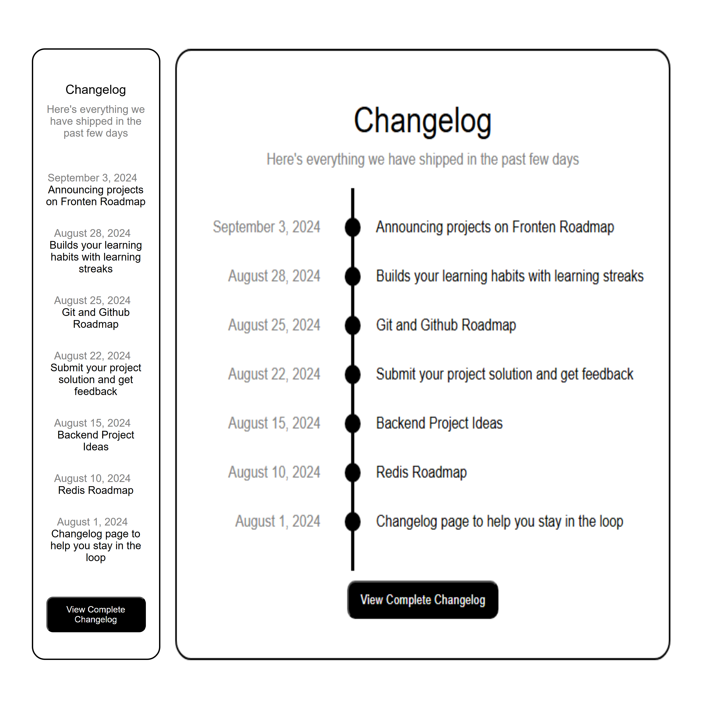
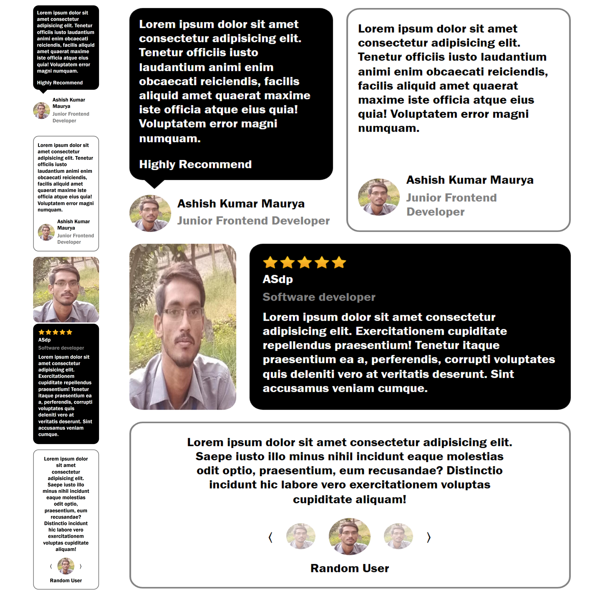

# Front-end Projects from Roadmap.sh

This repository contains front-end projects built following the [roadmap.sh](https://roadmap.sh/) front-end developer path.

## Projects List
[Single-Page CV](https://roadmap.sh/projects/single-page-cv)   <a href='/Frontend-Projects/01_Single-Page_CV/'>Click for Project files</a>\
[Basic HTML Website](https://roadmap.sh/projects/basic-html-website)\
[Personal Portfolio](https://roadmap.sh/projects/portfolio-website)\
[Changelog Component](https://roadmap.sh/projects/changelog-component)\
[Testimonial Cards](https://roadmap.sh/projects/testimonial-cards)

## Screenshot of Projects
### Click on any screenshot to go the project files

  
  

  
  

  

