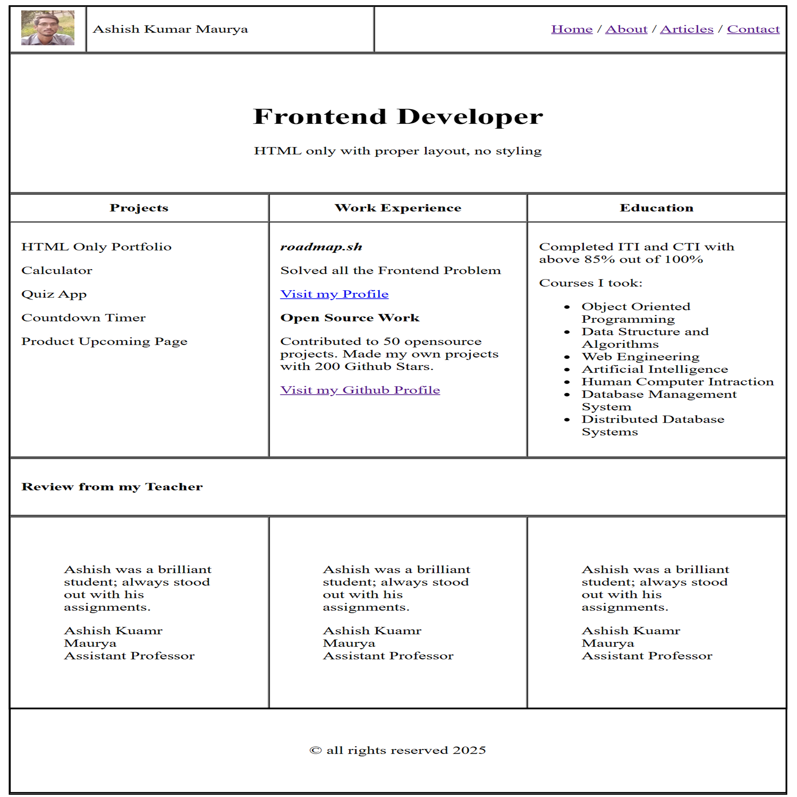

# Front-end Projects from Roadmap.sh

This repository contains front-end projects built following the [roadmap.sh](https://roadmap.sh/) front-end developer path.

## Projects List
[Single-Page CV](https://roadmap.sh/projects/single-page-cv)\
[Basic HTML Website](https://roadmap.sh/projects/basic-html-website)\
[Personal Portfolio](https://roadmap.sh/projects/portfolio-website)

## Screenshot of Projects

  
  

  

