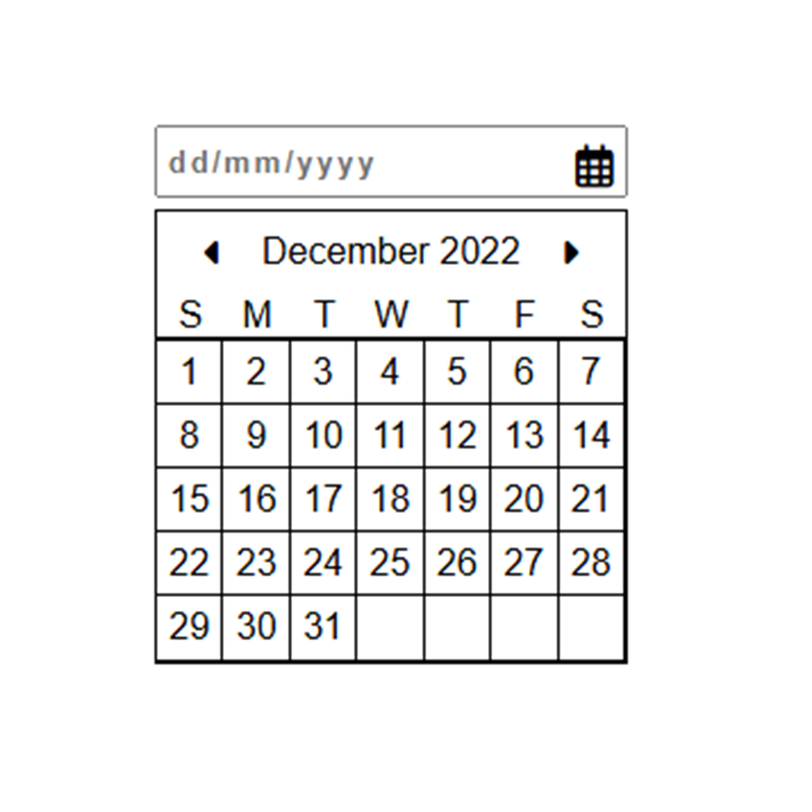

# Front-end Projects from Roadmap.sh

This repository contains front-end projects built following the [roadmap.sh](https://roadmap.sh/) front-end developer path.

## Projects List
[Project URL: Single-Page CV](https://roadmap.sh/projects/single-page-cv) | [Project files URL](/Frontend-Projects/01_Single-Page_CV/)  
[Project URL: Basic HTML Website](https://roadmap.sh/projects/basic-html-website) | [Project files URL](/Frontend-Projects/02_Basic-HTML-Website/)  
[Project URL: Personal Portfolio](https://roadmap.sh/projects/portfolio-website) | [Project files URL](/Frontend-Projects/03_Personal-Portfolio/)  
[Project URL: Changelog Component](https://roadmap.sh/projects/changelog-component) | [Project files URL](/Frontend-Projects/04_Changelog-Component/)  
[Project URL: Testimonial Cards](https://roadmap.sh/projects/testimonial-cards) | [Project files URL](/Frontend-Projects/05_Testimonial-Cards/)  
[Project URL: Datepicker UI](https://roadmap.sh/projects/datepicker-ui) | [Project files URL](/Frontend-Projects/06_Datepicker-UI/)

## Screenshot of Projects
### Click on any screenshot to go the project files

  
  

  
  

  
  

